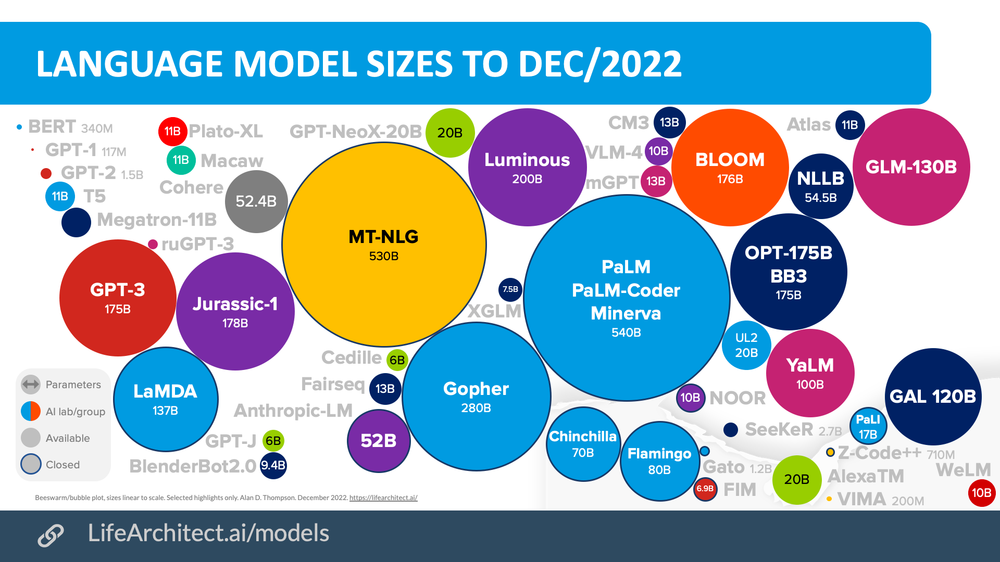

# GPT
Summary of studying GPT 3+ models and the ChatGPT Service I implemented

Generative pre-trained transformer
- 대용량 텍스트 데이터를 학습하여서 다음 단어를 예측하고 유기적인 대답을 생성할 수 있는 자연어 생성 모델.

위 그림에서 원의 크기는 모델의 parameter 개수를 의미하는데, 보통 파라미터가 많으면 AI의 성능이 좋습니다.
이중에서 GTP-3는 1750 억개의 파라미터를 가지고 있는데, 그 전 모델인 GPT-2 가 15억개였던 것에 비해서 파라미터가 크게 늘은 것.
(파라미터란 언어모델이 학습 중에 신경망에서 조정되는 값으로, 보통 파라미터가 많으면 AI의 성능이 좋아진다)
따라서 파라미터 입력 문장에 따라 유기적인 대답을 생성할수잇음

여기서 더 나아가서 gpt 3.5 라는 모델이 새로 생성됩니다.
- 기존 모델인 gpt 3에 어떠한 목적을 부여해서 그에 부합하게 새로운 모델을 만드는 것이다.
chat gpt 는 3.5 모델을 기반으로 하고 있고 이름답게, 대화라는 목적을 부여하고 그에 초점을 맞춰 학습됨.

- 3.5는 단순히 말해 인간에 의한 강화학습이다.

인간의 도움 없이 새로운 모델을 만들었는데 대부분 인터넷에서 자료를 긁어왔기 때문에 그 결과에는 폭력적이거나 선정적이거나 /자해/혐오/차별 등등 관련된 인간이 원하지 않는 응답도 포함되어 있을 수 있었음.
따라서 어느 정도는 인간이 방향성을 정해줄 필요가 있는데, RLHF가 그것이고 3.5가 그렇게 학습된 것이다.
RLHF(Rainforcement Learning from Human Feedback) 기법을 도입하여 학습. 단순히 말해 인간에 의한 강화학습이다.

내가 사용한 3.5-turbo 모델은 3 모델의 라인업이며,
openAI 오피셜로 현재 기존의 대답 모델과 같이 탁월한 답변을 줄 수 있으며 동시에 대화에 최적화된 모델이라 한다.
또한 가격이 싸기 때문에 가장 효율적일 수 있다.

gpt-3.5-turbo 모델에는 주요한 특성이 있었는데,
### 바로 **Role** 임.
system, assistant, user 의 롤을 정한 completion 으로 api 요청을 줄 수 있었다.
쉽게 말하면 역할을 부여해주는 것임.
system 의 롤을 'You are a Doctor' 라고 정하면 gpt 모델은 의사와 같은 답변을 제시하도록 assistant 에게 요청함.
그런 assistant 는 의사와 같은 답변을 내놓음.
'teacher' 라 하면 선생님과 같은 답변을 내놓음.

이것을 조절하여서 답변 주체의 화법, 문체, 지적 수준 등등을 조절할 수가 있었음. 참으로 신기했음.

그 다음 중요한 것은 개발 도중 깨달은 것.
### 챗 모델이라 했으면서 왜 나는 GPT 랑 대화가 안되는데?
내가 전에 했던 질문과 연관된 질문을 하면 gpt 가 전의 질문을 기억하지 못했음.
해결방안으로는 DB 에 저장을 하여 메시지를 긁어와야 했음.
여기서 조금 헤맸는데 assitant 메시지에 gpt의 대답을 저장했고 user 의 메시지에 내 대답을 저장했는데
대화가 이어지면 이어질 수록 gpt 가 사용하는 토큰의 수가 점점 늘어갔음.
처음엔 150개 였더라도 질문 5번만 하면 2000개가 쓰여짐. 그 전 대화들을 다 기억하여 대답을 내놓는데 쓰기 때문에 토큰의 수가 높은 것임.
이걸 어떻게 줄일까 생각을 해봤는데,
일단 기억할 수 있는 대답의 개수를 조절해줘야 했음. 또한 user 의 질문은 가장 최근 질문만 기억하면 됨.
즉, 이전의 대답을 기억하기 위한 api 요청을 할 completion 이 가지는 role, message 배열은
['system':'message', 'assistant: 'message' ,'assistant: 'message', 'assistant: 'message', ... , 'user' : 'message']
가 되는 것.